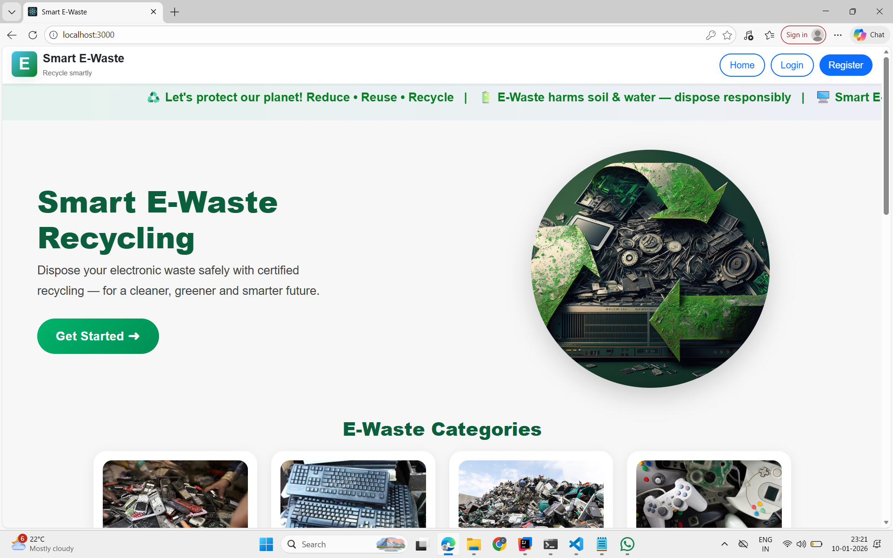
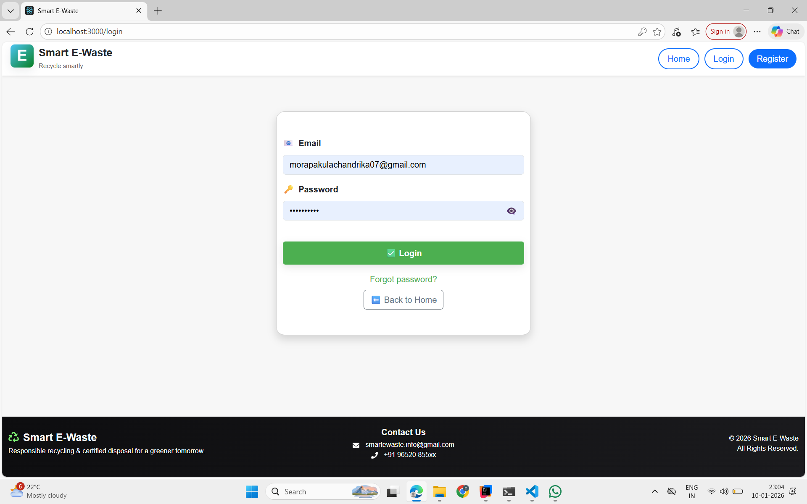
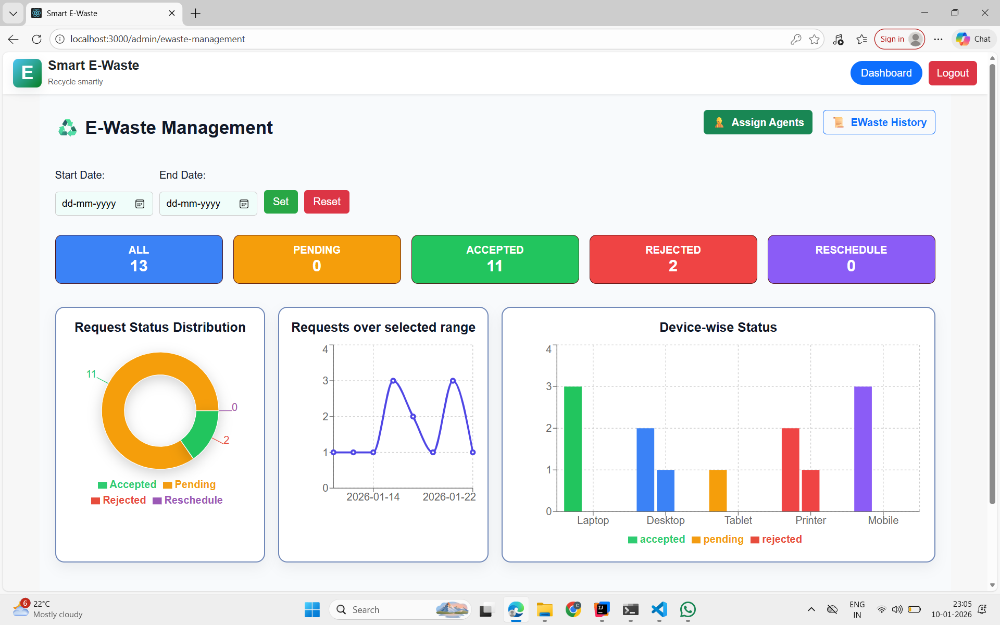
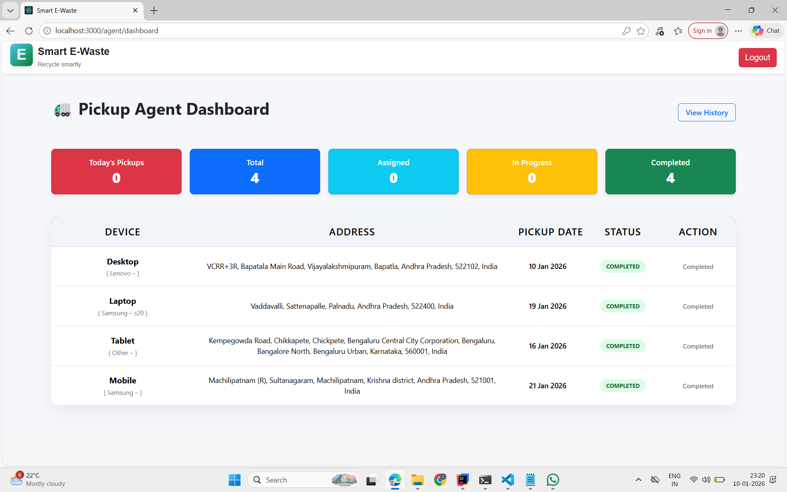
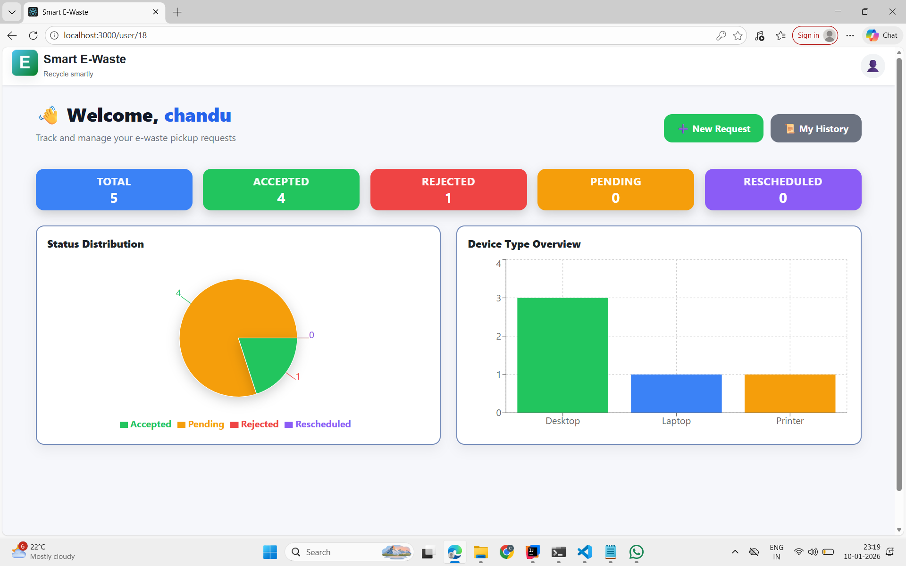

# Smart-E-waste-WebApplication
# ♻️ Smart E-Waste Management System

---

## 🌐 Live Demo

🚧 Coming Soon...

## 📂 GitHub Repository

👉 https://github.com/morapakulachandrika/Smart-E-waste-WebApplication

---

## 📌 Project Overview

The **Smart E-Waste Management System** is a full-stack web application designed to streamline the collection, management, and recycling of electronic waste. It connects users, administrators, and pickup agents to ensure efficient and eco-friendly disposal.

---

## 🚀 Tech Stack


\

* **Frontend:** React.js, CSS
* **Backend:** Spring Boot (Java)
* **Database:** MySQL
* **Other Tools:** REST APIs, JWT Authentication

---

## 🎯 Key Highlights

✔ Full Stack Application (Spring Boot + React)
✔ Role-Based Access (Admin, User, Pickup Agent)
✔ Real-time Request Management
✔ Secure Authentication System (JWT)
✔ Email Notification System
✔ Responsive UI Design

---

## ✨ Features

### 👤 User

* Register and login securely
* Submit e-waste pickup requests
* Track request status
* View request history

### 🛠️ Admin

* Manage users and pickup agents
* Approve/reject requests
* Assign pickup agents
* Monitor system activities

### 🚚 Pickup Agent

* View assigned pickups
* Update pickup status
* Manage completed requests

### 📧 Email Notifications

* Welcome email
* Request submission confirmation
* Approval/rejection updates
* Password reset emails

---

## 🏗️ Project Structure

```
smart-ewaste (Backend - Spring Boot)
smart-front   (Frontend - React)
```

---

## ⚙️ Installation & Setup

### 🔹 Backend (Spring Boot)

```
cd smart-ewaste
mvn spring-boot:run
```

### 🔹 Frontend (React)

```
cd smart-front
npm install
npm start
```

---


## 📸 Screenshots

### 🏠 Home Page


### 🔐 Login Page


### 📊 Admin Dashboard


### 🚚 Pickup Page


### 👤 User Dashboard

---

## 📈 Future Enhancements

* AI-based waste classification
* Mobile application support
* Real-time tracking system

---

## 👩‍💻 Author

**Chandrika Morapakula**

---

## 📢 Conclusion

This project promotes responsible e-waste disposal and contributes to environmental sustainability using modern web technologies.

---
